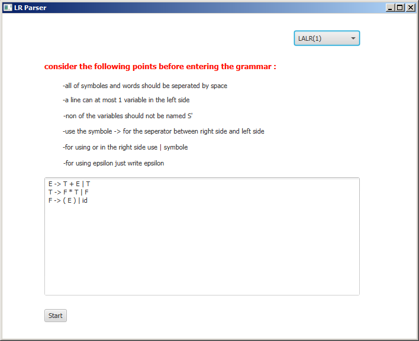
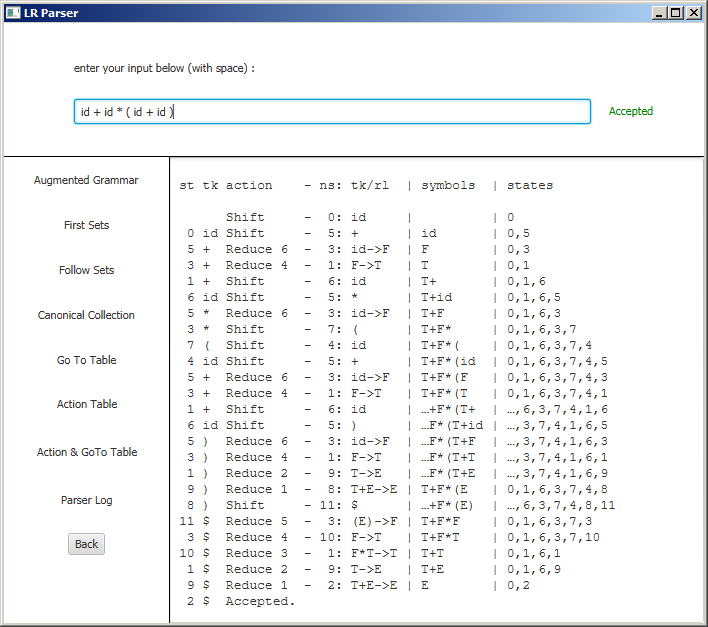

# LR Parser (LR(0), SLR(1), CLR(1) and LALR(1))
[LR Parser](https://en.wikipedia.org/wiki/LR_parser) is a bottom-up parser for reading grammar. There are different kinds of LR Parser which some of them are: SLR parsers, LALR parsers, Canonical LR(1) parsers.

I implemented these parsers using java with GUI to be used more conveniently. It's very simple.First you enter your context-free grammar choose the parser(LR(0), SLR(1), CLR(1) and LALR(1)). Then, you can see all the properties of the parsed grammar (Augmented Grammar, First Sets, Follow Sets, Canonical Collection, Go To Table, Action Table) by clicking on the corresponding button. Also, you can give different input and check whether grammar accepts the string or not.

here are two screenshot from the application:

